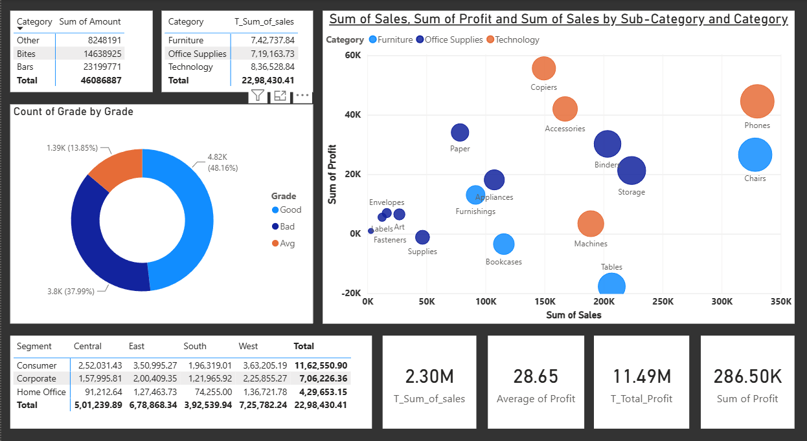
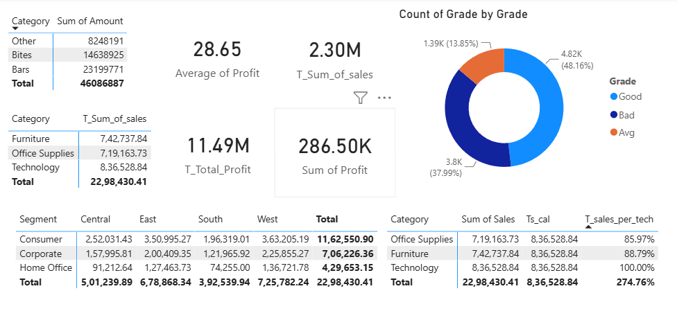
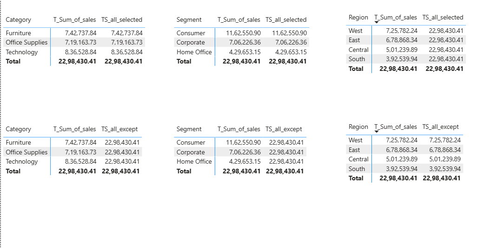
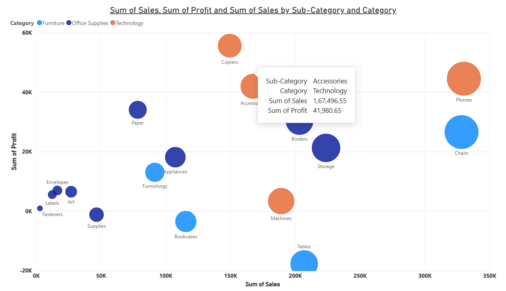
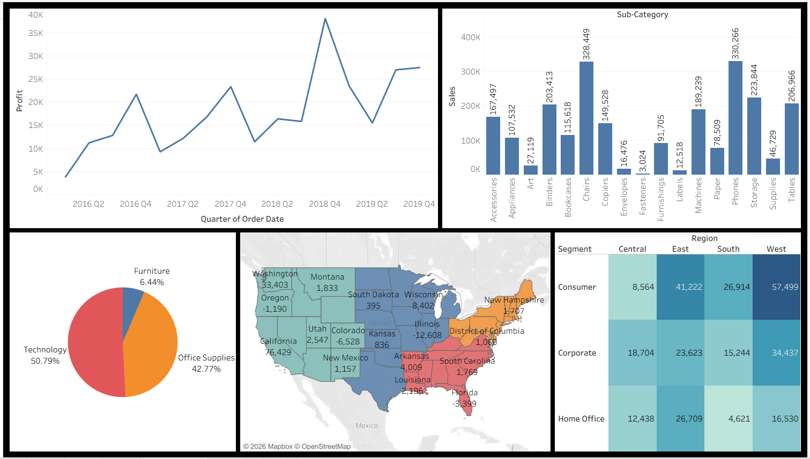
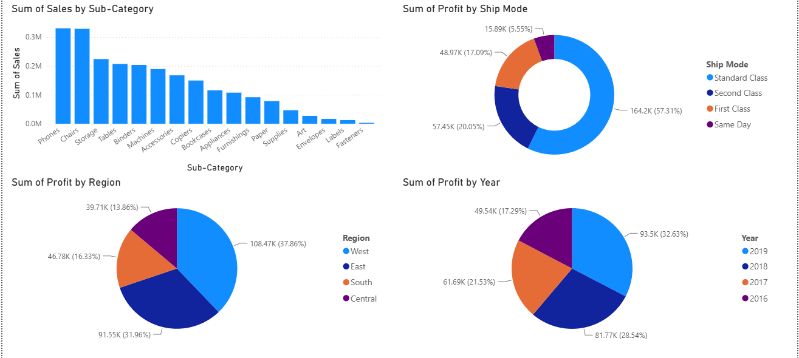
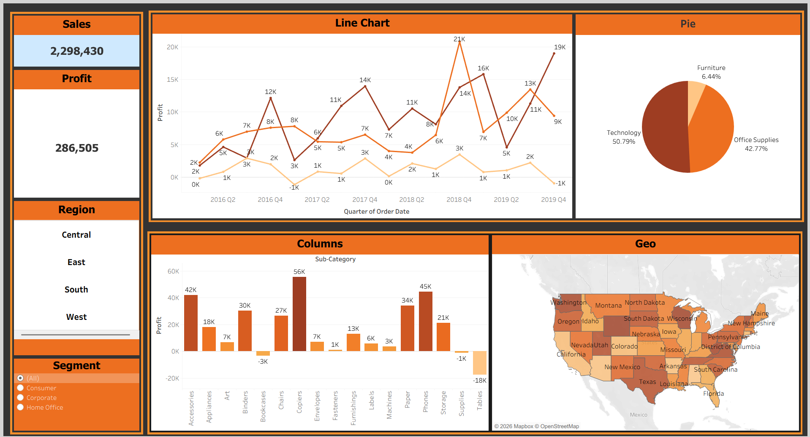
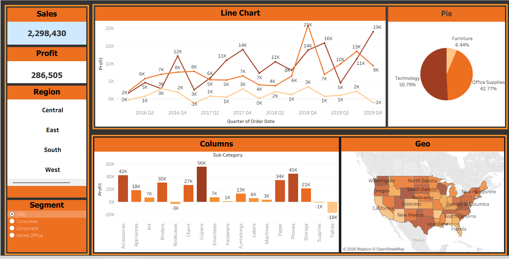

# 📊 Data Visualization & Dashboarding — Daily Progress Log

A day-wise record of my hands-on practice across **Excel**, **Power BI**, and **Tableau**, built around the Superstore sales dataset. Each day lists what was practiced and the final visual(s) produced.

> ⚠️ **Note on this file:** I matched each screenshot to a day based on file names and timestamps. Please double-check the mapping for Days 4–8 (multiple files were saved close together) and correct any labels/notes below before sharing this as a portfolio README.

---

## Day 01 — Excel Fundamentals
**File:** `Day_01.xlsx`

- Set up base worksheet(s) with raw/staging data (2 sheets).
- Practiced core Excel fundamentals — formatting, basic formulas, and data cleanup — to prepare the dataset for later analysis.

**Visuals created:** None yet — this was a data-prep/foundation day.

---

## Day 02 — Excel Formulas & Data Modeling
**File:** `Day_02.xlsx`

- Expanded the workbook to 7 sheets, layering in more advanced formulas (lookups, aggregations) and structured data ranges.
- Built the analytical groundwork (helper columns, summary tables) that later feeds the Day 3 dashboard.

**Visuals created:** Supporting tables/summaries — no standalone dashboard yet.

---

## Day 03 — Excel Interactive Dashboard
**Files:** `Day_03.xlsx`, `Day_03_dashboard.jpg`, `Day_03_dashboard.pdf`, `Day_03_dashboard1.pdf`

- Added `h_vlookup` sheet — practiced VLOOKUP-based joins across tables.
- Assembled a full **Superstore Dashboard** in Excel using native charts + slicers:
  - Quarterly sales trend (line chart)
  - Sales by Day of Week (stacked column)
  - Regional split (3D pie)
  - Waterfall/increase-decrease chart
  - Category-wise profit (Central/East/South/West)
  - State-wise sales heat map (US map)
  - State-wise sales bar chart
  - Slicers for Category, Region, and Year

**Visuals created — Day 3 Dashboard:**

---

## Day 04 — Power BI: KPIs, DAX Measures & Bubble Charts
**Files:** `Day_04_0.pbix`, `Day_04_1.pbix`, `Day_04_2.pbix`

- Built KPI cards: Total Sales (2.30M), Average Profit (28.65), Total Profit (11.49M), Sum of Profit (286.50K).
- Practiced **DAX filter-context measures** — comparing `CALCULATE` behavior across `ALL`, `ALLEXCEPT`, and `ALLSELECTED` on Category, Segment, and Region tables.
- Created a "Grade" classification donut chart (Good/Bad/Avg).
- Built a **bubble chart** — Sum of Sales vs Sum of Profit by Sub-Category and Category, with tooltip details (e.g., Accessories: Sales ₹1,67,496.55 / Profit ₹41,980.65).
- Segment × Region summary tables (Consumer/Corporate/Home Office).

**Visuals created — Day 4:**

Full dashboard (KPIs, Grade donut, bubble chart, segment tables):

KPI cards + Grade donut (close-up):

DAX measure comparison tables (ALL vs ALLEXCEPT vs ALLSELECTED):

Bubble chart tooltip detail:

---

## Day 05 — Power BI: Trend, Category & Geo Analysis
**File:** `Day_05.pbix`

- Quarterly profit trend line chart (2016–2019).
- Sales by Sub-Category (bar chart).
- Category split pie chart (Technology 50.79% / Office Supplies 42.77% / Furniture 6.44%).
- State-level profit map (choropleth of the US).
- Segment × Region cross-tab (heatmap-styled table).

**Visuals created — Day 5 Dashboard:**

---

## Day 06 — Power BI + Tableau: Ship Mode & Yearly Breakdown
**Files:** `Day_06.pbix`, `Day_06.twb`

- Sum of Sales by Sub-Category (bar chart).
- Sum of Profit by Ship Mode (donut: Standard Class 57.31%, Second Class 20.05%, First Class 17.09%, Same Day 5.55%).
- Sum of Profit by Region (pie: West 37.86%, East 31.96%, South 16.33%, Central 13.86%).
- Sum of Profit by Year (pie: 2019 32.63%, 2018 28.54%, 2017 21.53%, 2016 17.29%).
- Rebuilt the same analysis in Tableau (`.twb`) alongside the Power BI version to compare tooling.

**Visuals created — Day 6 Dashboard:**

---

## Day 07 — Tableau Dashboard + Presentation
**Files:** `Day_07.twb`, `Day_07.pptx`

- Built a polished Tableau dashboard: Sales (2,298,430) and Profit (286,505) KPI cards, Region filter (Central/East/South/West), Segment filter.
- Line chart of Sales/Profit/Quantity trend by quarter (2016 Q2 – 2019 Q4).
- Category pie chart (Technology/Office Supplies/Furniture).
- Sub-Category profit column chart.
- Geo map of profit by state.
- Packaged the dashboard walkthrough into a PowerPoint (`Day_07.pptx`) for presentation.

**Visuals created — Day 7 Dashboard:**

---

## Day 08 — Tableau: Final Refinement
**File:** `Day_08.twb`

- Refined and polished the Day 7 Tableau dashboard — layout, sizing, and filter behavior improvements to the same Sales/Profit KPI + Line/Pie/Column/Geo layout.

**Visuals created — Day 8 Dashboard:**

---

## 📁 File Index

| Day | Tool | Files |
|-----|------|-------|
| 1 | Excel | `Day_01.xlsx` |
| 2 | Excel | `Day_02.xlsx` |
| 3 | Excel | `Day_03.xlsx`, `Day_03_dashboard.jpg`, `Day_03_dashboard.pdf`, `Day_03_dashboard1.pdf` |
| 4 | Power BI | `Day_04_0.pbix`, `Day_04_1.pbix`, `Day_04_2.pbix` |
| 5 | Power BI | `Day_05.pbix` |
| 6 | Power BI + Tableau | `Day_06.pbix`, `Day_06.twb` |
| 7 | Tableau + PPT | `Day_07.twb`, `Day_07.pptx` |
| 8 | Tableau | `Day_08.twb` |
